# Tool Web

Tool Web is a full-stack collection of browser-local and server-backed utilities. This public distribution contains the complete React frontend, Spring Boot backend, document-conversion worker, database migrations, automated tests, and a container-first deployment bundle.

**在线体验 / Live demo:** [https://tool.hehesakura.cn/](https://tool.hehesakura.cn/)

**部署文档 / Deployment:** [中文](deploy/DEPLOYMENT.zh-CN.md) · [English](deploy/DEPLOYMENT.en.md)

[](https://tool.hehesakura.cn/)

## 工具一览 / Tool gallery

下面的截图均使用 Chrome 从在线网站实机截取。点击工具名称或截图即可直接打开对应工具。

Every screenshot below was captured from the live website with Chrome. Select a tool name or screenshot to open it online.

### 开发工具 / Developer tools

<table>
  <tr>
    <td width="50%" valign="top">
      <a href="https://tool.hehesakura.cn/tools/timestamp-converter"><strong>时间戳转换 / Timestamp Converter</strong></a>
      <p>在 Unix 时间戳与日期时间之间双向转换，支持秒、毫秒、微秒、纳秒、时区和批量处理。<br><sub>Convert between Unix timestamps and date-time values with multiple units, time zones, and batch processing.</sub></p>
      <a href="https://tool.hehesakura.cn/tools/timestamp-converter">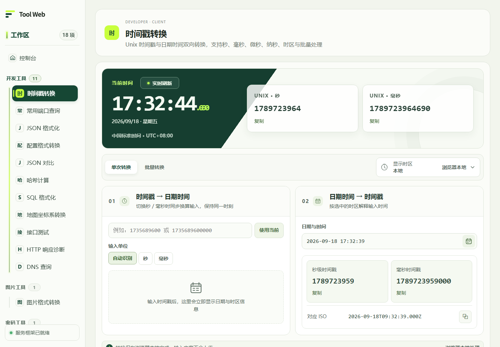</a>
    </td>
    <td width="50%" valign="top">
      <a href="https://tool.hehesakura.cn/tools/common-ports"><strong>常用端口查询 / Common Ports</strong></a>
      <p>查询常用端口的默认服务、TCP/UDP 协议、用途、加密特征和使用说明。<br><sub>Look up common ports by service, TCP/UDP protocol, purpose, encryption, and usage notes.</sub></p>
      <a href="https://tool.hehesakura.cn/tools/common-ports">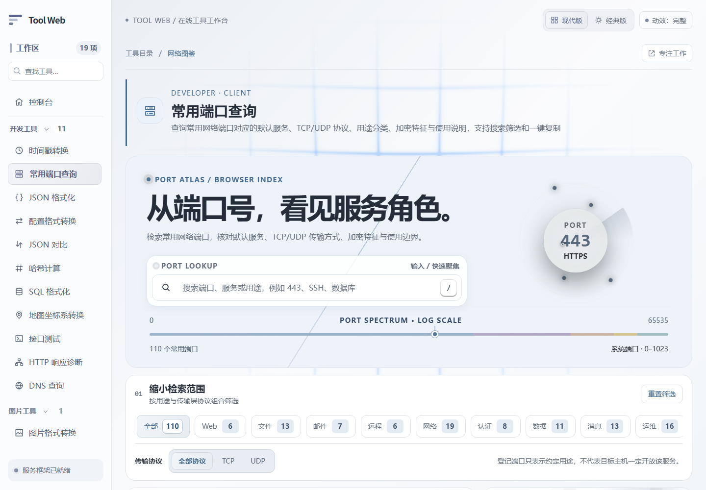</a>
    </td>
  </tr>
  <tr>
    <td width="50%" valign="top">
      <a href="https://tool.hehesakura.cn/tools/json-formatter"><strong>JSON 格式化 / JSON Formatter</strong></a>
      <p>在浏览器本地校验、美化、压缩和排序 JSON，并提供树形查看。<br><sub>Validate, pretty-print, minify, sort, and inspect JSON as a tree entirely in the browser.</sub></p>
      <a href="https://tool.hehesakura.cn/tools/json-formatter">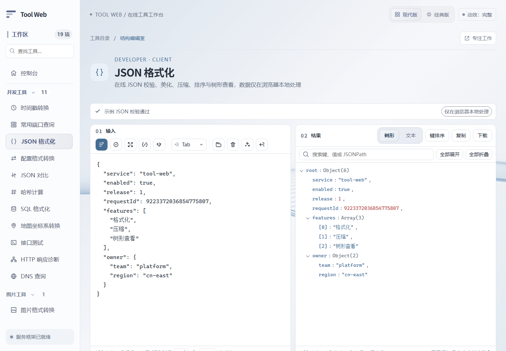</a>
    </td>
    <td width="50%" valign="top">
      <a href="https://tool.hehesakura.cn/tools/data-converter"><strong>配置格式转换 / Data Format Converter</strong></a>
      <p>在浏览器本地完成 JSON、YAML 与 Properties 的互转、格式化、合并、去重和递归排序。<br><sub>Convert, format, merge, deduplicate, and recursively sort JSON, YAML, and Properties data locally.</sub></p>
      <a href="https://tool.hehesakura.cn/tools/data-converter">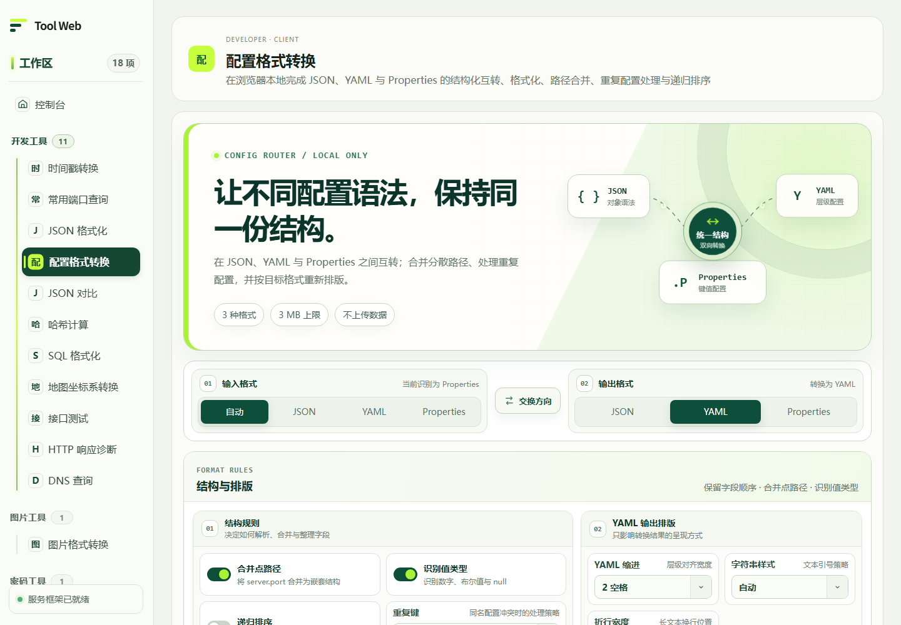</a>
    </td>
  </tr>
  <tr>
    <td width="50%" valign="top">
      <a href="https://tool.hehesakura.cn/tools/json-diff"><strong>JSON 对比 / JSON Diff</strong></a>
      <p>按字段对比两份 JSON，清晰定位新增、删除和修改内容。<br><sub>Compare two JSON documents by field and highlight additions, removals, and changes.</sub></p>
      <a href="https://tool.hehesakura.cn/tools/json-diff">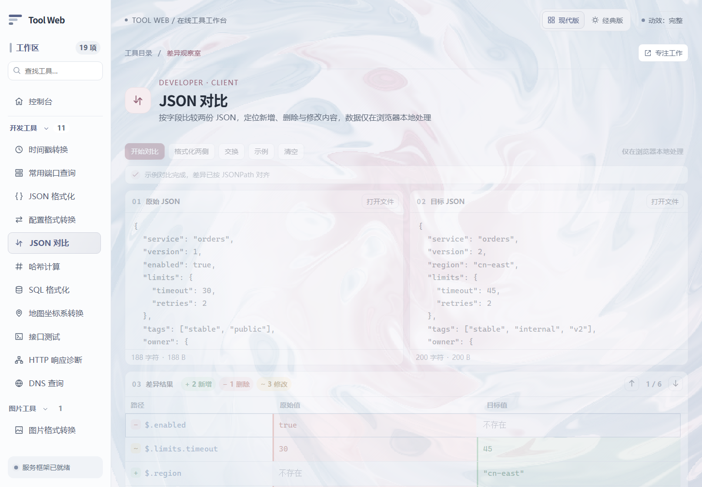</a>
    </td>
    <td width="50%" valign="top">
      <a href="https://tool.hehesakura.cn/tools/hash"><strong>哈希计算 / Hash Calculator</strong></a>
      <p>计算 MD5、SHA、SHA3、RIPEMD160 与 HMAC，支持文本逐行和文件分块处理。<br><sub>Calculate MD5, SHA, SHA3, RIPEMD160, and HMAC values for text lines or chunked files.</sub></p>
      <a href="https://tool.hehesakura.cn/tools/hash">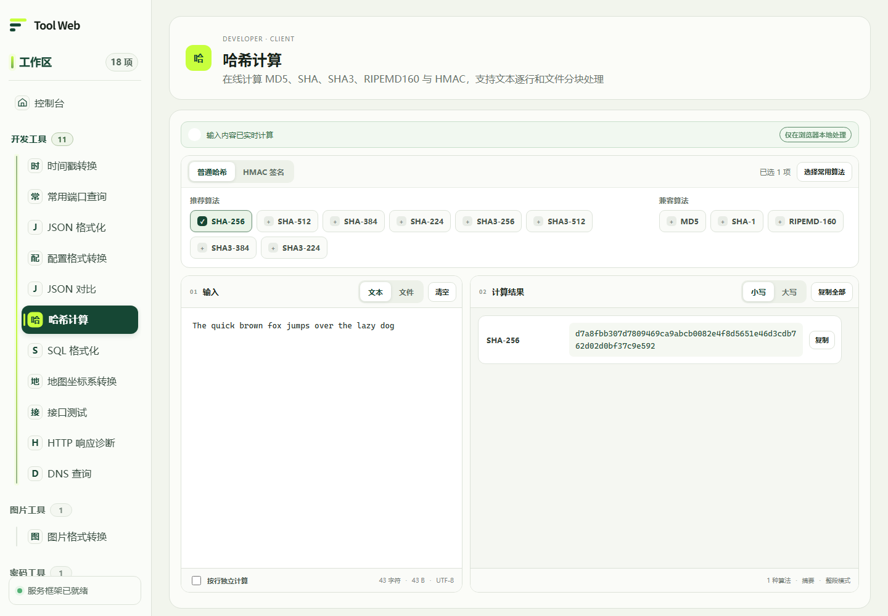</a>
    </td>
  </tr>
  <tr>
    <td width="50%" valign="top">
      <a href="https://tool.hehesakura.cn/tools/sql-formatter"><strong>SQL 格式化 / SQL Formatter</strong></a>
      <p>美化或压缩 SQL，支持 MySQL、PostgreSQL、SQL Server、Oracle 等数据库方言。<br><sub>Pretty-print or minify SQL for MySQL, PostgreSQL, SQL Server, Oracle, and other dialects.</sub></p>
      <a href="https://tool.hehesakura.cn/tools/sql-formatter">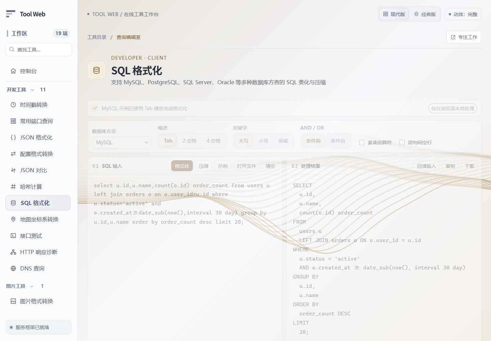</a>
    </td>
    <td width="50%" valign="top">
      <a href="https://tool.hehesakura.cn/tools/coordinate"><strong>地图坐标系转换 / Coordinate Converter</strong></a>
      <p>转换 WGS84、GCJ-02 和 BD-09 坐标，覆盖高德、腾讯、百度与 Google 等地图来源。<br><sub>Convert WGS84, GCJ-02, and BD-09 coordinates used by major map providers.</sub></p>
      <a href="https://tool.hehesakura.cn/tools/coordinate">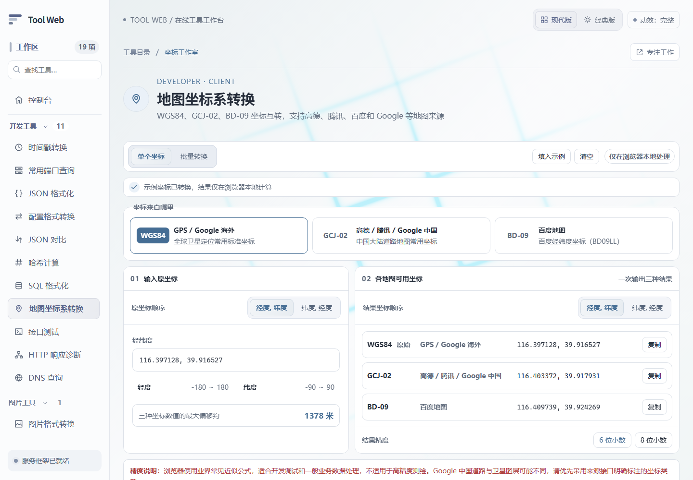</a>
    </td>
  </tr>
  <tr>
    <td width="50%" valign="top">
      <a href="https://tool.hehesakura.cn/tools/api-test"><strong>接口测试 / API Tester</strong></a>
      <p>配置并发送 HTTP 请求，查看格式化响应、Headers 和分阶段耗时。<br><sub>Compose HTTP requests and inspect formatted responses, headers, and phase-by-phase timing.</sub></p>
      <a href="https://tool.hehesakura.cn/tools/api-test">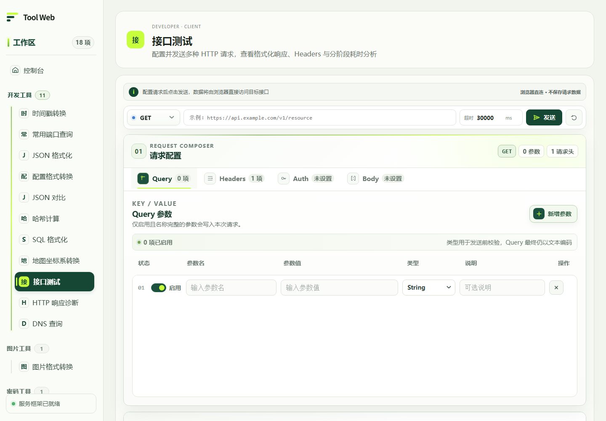</a>
    </td>
    <td width="50%" valign="top">
      <a href="https://tool.hehesakura.cn/tools/http-response-diagnostics"><strong>HTTP 响应诊断 / HTTP Response Diagnostics</strong></a>
      <p>安全探测公开 HTTP 地址，分析状态码、重定向、响应头、压缩、缓存策略和连接耗时。<br><sub>Probe public HTTP endpoints and analyze status, redirects, headers, compression, caching, and timing.</sub></p>
      <a href="https://tool.hehesakura.cn/tools/http-response-diagnostics">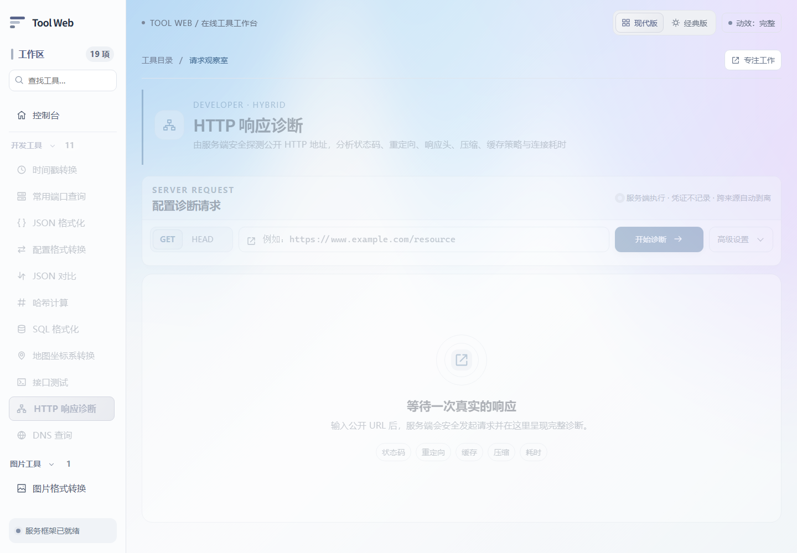</a>
    </td>
  </tr>
  <tr>
    <td width="50%" valign="top">
      <a href="https://tool.hehesakura.cn/tools/dns-query"><strong>DNS 查询 / DNS Lookup</strong></a>
      <p>并行查询公共 DNS，比较常见记录类型、TTL 和解析链路。<br><sub>Query public DNS resolvers in parallel and compare common record types, TTLs, and resolution chains.</sub></p>
      <a href="https://tool.hehesakura.cn/tools/dns-query">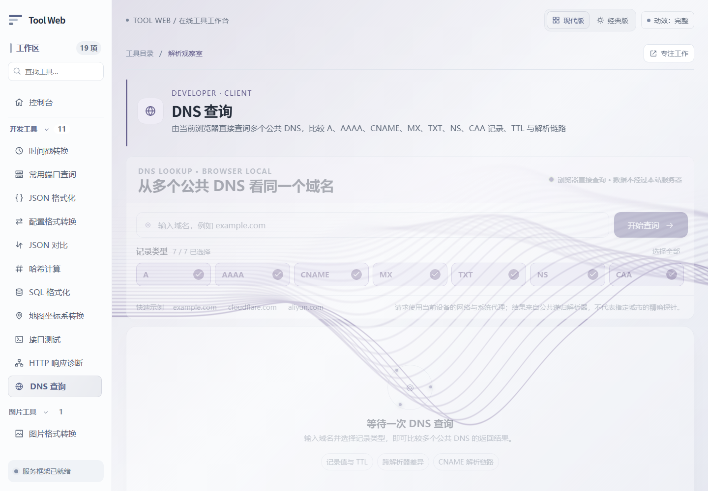</a>
    </td>
    <td width="50%" valign="top"></td>
  </tr>
</table>

### 图片与密码工具 / Image and password tools

<table>
  <tr>
    <td width="50%" valign="top">
      <a href="https://tool.hehesakura.cn/tools/image-converter"><strong>图片格式转换 / Image Converter</strong></a>
      <p>批量转换 JPG、PNG 和 WebP，支持质量、尺寸、透明背景、效果预览与打包下载。<br><sub>Batch-convert JPG, PNG, and WebP images with quality, sizing, transparency, preview, and ZIP download options.</sub></p>
      <a href="https://tool.hehesakura.cn/tools/image-converter">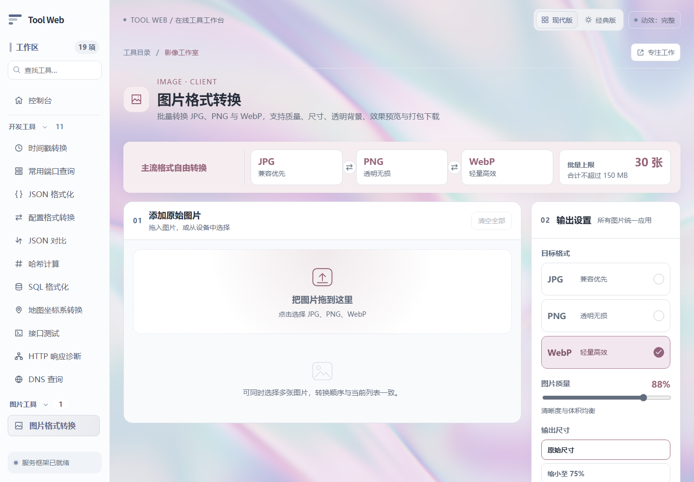</a>
    </td>
    <td width="50%" valign="top">
      <a href="https://tool.hehesakura.cn/tools/password-generator"><strong>密码生成器 / Password Generator</strong></a>
      <p>本地生成随机密码、开发者令牌和口令短语，支持强度评估、批量生成与复制。<br><sub>Generate passwords, developer tokens, and passphrases locally with strength checks and batch output.</sub></p>
      <a href="https://tool.hehesakura.cn/tools/password-generator">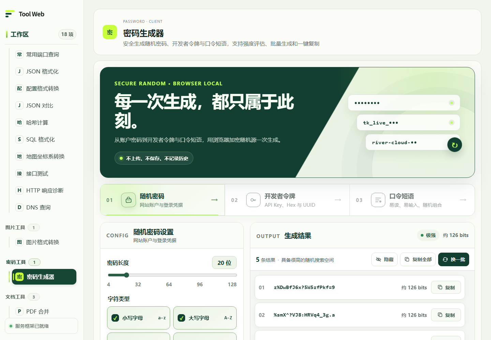</a>
    </td>
  </tr>
</table>

### PDF 与文档工具 / PDF and document tools

<table>
  <tr>
    <td width="50%" valign="top">
      <a href="https://tool.hehesakura.cn/tools/pdf-merge"><strong>PDF 合并 / PDF Merge</strong></a>
      <p>在浏览器本地合并多个 PDF，支持文件排序、页数统计与结果下载。<br><sub>Merge multiple PDFs locally with file ordering, page counts, and result download.</sub></p>
      <a href="https://tool.hehesakura.cn/tools/pdf-merge">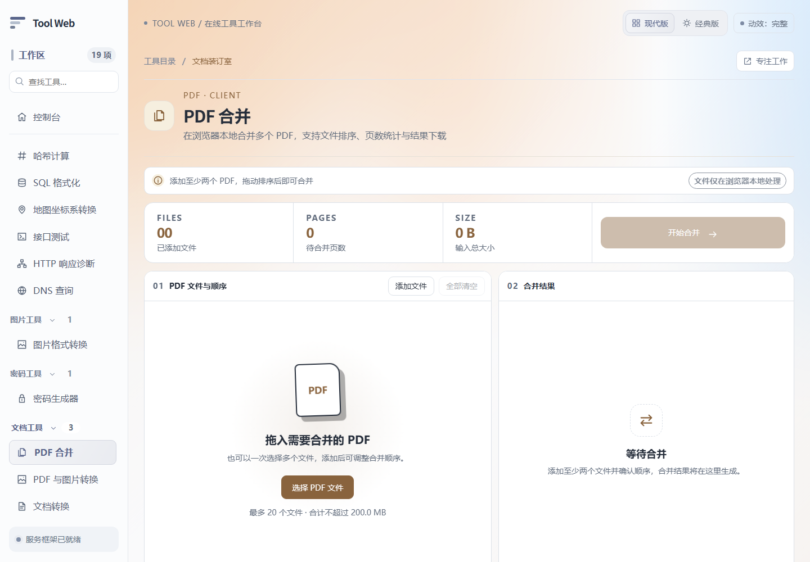</a>
    </td>
    <td width="50%" valign="top">
      <a href="https://tool.hehesakura.cn/tools/pdf-image-converter"><strong>PDF 与图片转换 / PDF–Image Converter</strong></a>
      <p>将 PDF 指定页面转为 PNG/JPG，或按顺序将多张图片转换为 PDF。<br><sub>Export selected PDF pages as PNG/JPG or combine ordered images into a PDF.</sub></p>
      <a href="https://tool.hehesakura.cn/tools/pdf-image-converter">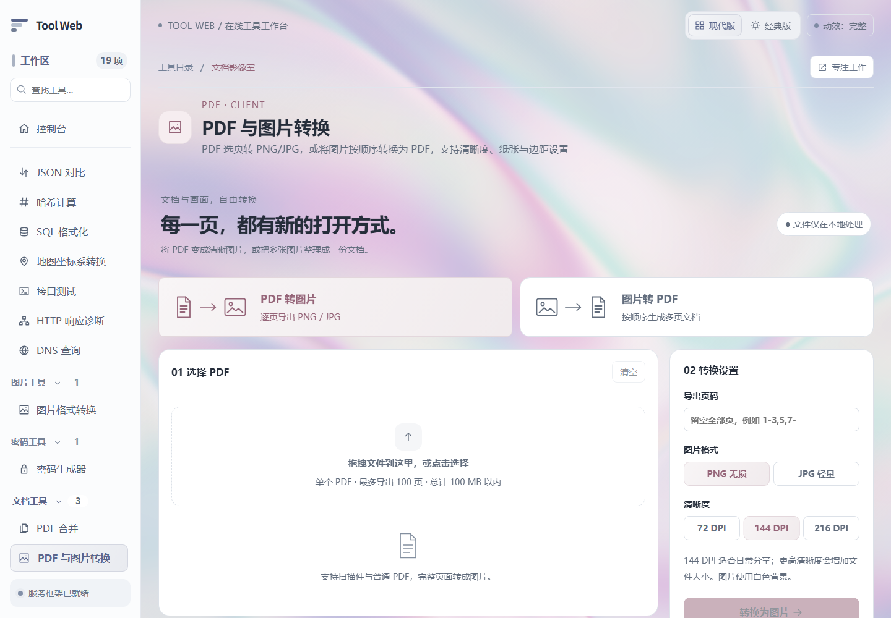</a>
    </td>
  </tr>
  <tr>
    <td width="50%" valign="top">
      <a href="https://tool.hehesakura.cn/tools/document-converter"><strong>文档转 Markdown / Document to Markdown</strong></a>
      <p>将 PDF、Word、PowerPoint、Excel、HTML 和文本等文档转换为 Markdown，单文件最大 10 MB。<br><sub>Convert PDF, Word, PowerPoint, Excel, HTML, text, and other documents to Markdown, up to 10 MB per file.</sub></p>
      <a href="https://tool.hehesakura.cn/tools/document-converter">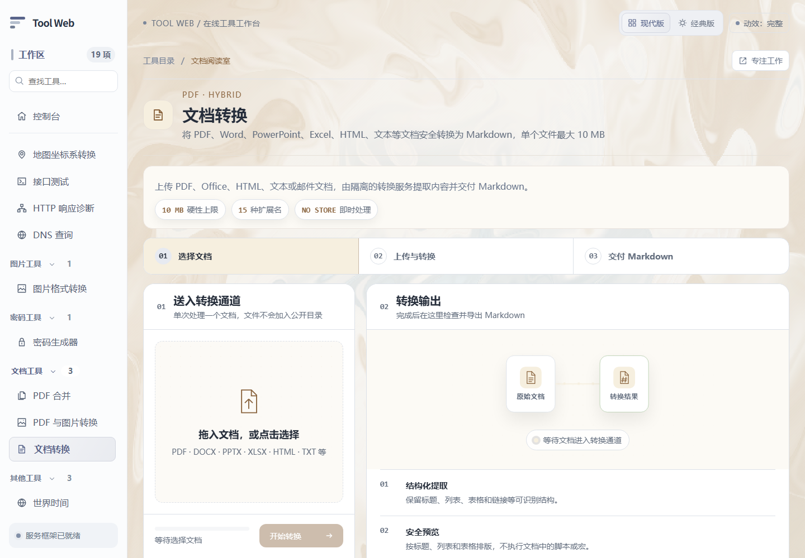</a>
    </td>
    <td width="50%" valign="top"></td>
  </tr>
</table>

### 其他工具 / Other utilities

<table>
  <tr>
    <td width="50%" valign="top">
      <a href="https://tool.hehesakura.cn/tools/world-time"><strong>世界时间 / World Time</strong></a>
      <p>实时查看全球城市时间，并支持时区搜索、指定时间换算和夏令时偏移。<br><sub>View city times worldwide and convert specific times with time-zone search and DST offsets.</sub></p>
      <a href="https://tool.hehesakura.cn/tools/world-time">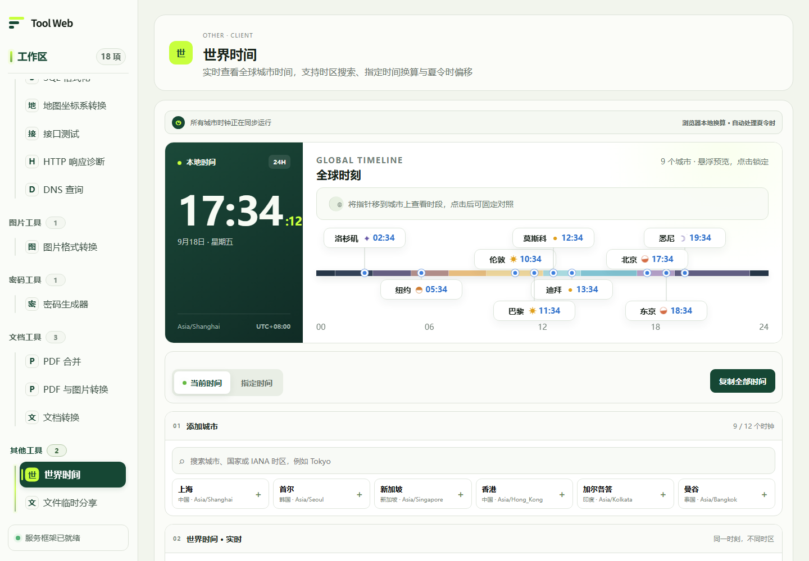</a>
    </td>
    <td width="50%" valign="top">
      <a href="https://tool.hehesakura.cn/tools/temporary-file-share"><strong>文件临时分享 / Temporary File Sharing</strong></a>
      <p>上传文件并生成带密钥的分享链接；链接固定五分钟有效，且仅允许下载一次。<br><sub>Upload a file and create a keyed share link that expires after five minutes and permits one download.</sub></p>
      <a href="https://tool.hehesakura.cn/tools/temporary-file-share">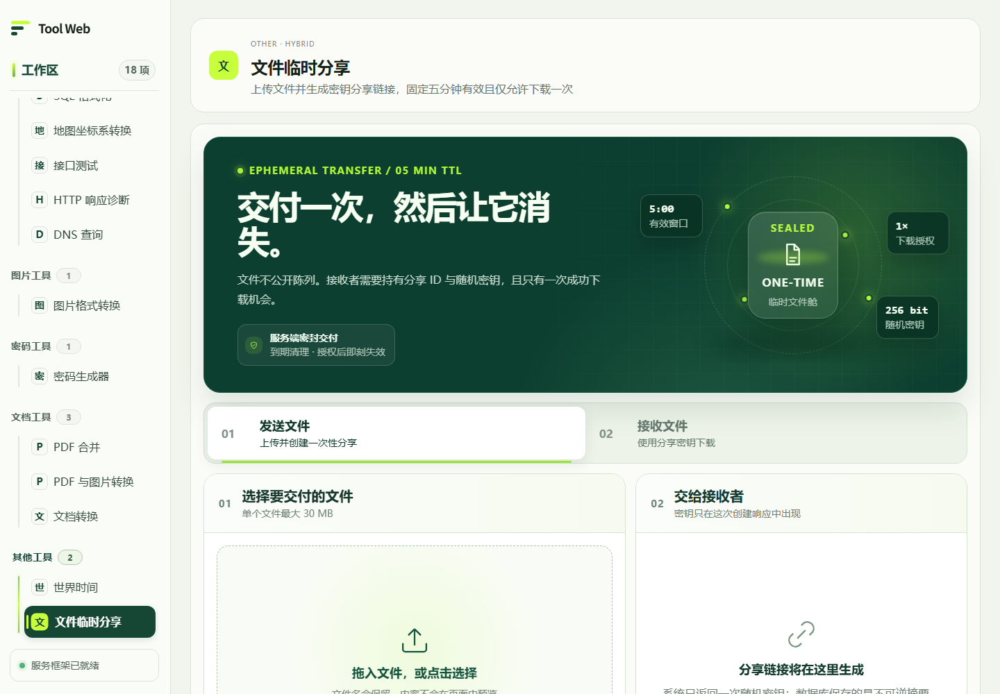</a>
    </td>
  </tr>
</table>

## 中文

### 项目结构

- `frontend/`：React 19、TypeScript 6、Vite 8 和非 root Nginx 运行镜像。
- `backend/`：Java 25、Spring Boot 4、MyBatis-Plus、Flyway、MySQL 和 S3/RustFS 集成。
- `markitdown-worker/`：隔离的 FastAPI + MarkItDown 文档转换 Worker。
- `deploy/`：MySQL、RustFS、Worker、后端和前端的完整 Docker Compose 部署。

完整中文部署步骤见 [`deploy/DEPLOYMENT.zh-CN.md`](deploy/DEPLOYMENT.zh-CN.md)。

### 本地验证

```bash
cd backend
./mvnw verify

cd ../frontend
npm ci
npm run lint
npm test
npm run build

cd ../markitdown-worker
python -m venv .venv
# Linux/macOS: source .venv/bin/activate
# Windows: .venv\Scripts\Activate.ps1
python -m pip install -e ".[dev]"
pytest
ruff check .
mypy
```

本地开发默认使用文件系统保存临时分享；生产配置使用私有 RustFS Bucket。所有真实密码、Token、域名和基础设施地址都必须通过本地环境变量或未提交的 `deploy/.env` 提供。

## English

### Repository layout

- `frontend/`: React 19, TypeScript 6, Vite 8, and an unprivileged Nginx runtime image.
- `backend/`: Java 25, Spring Boot 4, MyBatis-Plus, Flyway, MySQL, and S3/RustFS integration.
- `markitdown-worker/`: isolated FastAPI + MarkItDown document-conversion worker.
- `deploy/`: complete Docker Compose deployment for MySQL, RustFS, worker, backend, and frontend.

See [`deploy/DEPLOYMENT.en.md`](deploy/DEPLOYMENT.en.md) for complete English deployment instructions.

### Local verification

Use the commands in the Chinese section above. On Windows, run `mvnw.cmd verify` instead of `./mvnw verify` if necessary.

Local development defaults to filesystem-backed temporary sharing. Production uses a private RustFS bucket. Supply real passwords, tokens, domains, and infrastructure addresses only through local environment variables or the uncommitted `deploy/.env` file.

## Publication note

This sanitized tree intentionally excludes private Git history, credentials, logs, build outputs, editor settings, local caches, legacy environment-specific deployment files, and unrelated reference material. Choose and add the project's open-source license before publishing the repository.
